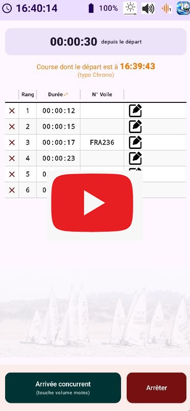

# Chrono Régate Comité - Départs, arrivées et chronométrage de course

Chrono Régate Comité est une application de chronométrage de haute précision spécialement conçue pour les **régates nautiques** (voiliers, dériveur, planche à voile, etc.). Elle permet aux officiels de course de gérer les procédures de départ normalisées, de suivre les arrivées en temps réel et d'exporter les résultats officiels.

**Prérequis :** Compatible avec tous les appareils sous **Android 7.0 (Nougat) ou supérieur** (SDK 24+).

## Fonctionnalités pour les Régates

*   **Procédures de Départ Normalisées :** Supporte les séquences de compte à rebours "3 2 1 0", "5 4 1 0", "6 4 1 0", "8 4 1 0" et "10 4 1 0" avec bips sonores synchronisés pour signaler les étapes clés du départ.
*   **Enregistrement des Arrivées :** Capture instantanée de l'heure d'arrivée (au dixième de seconde) via le bouton à l'écran ou la touche physique **Volume Bas**, idéale pour garder les yeux sur la ligne d'arrivée.
*   **Tableau de Bord en Temps Réel :** Affichage persistant de l'heure actuelle, du pourcentage de batterie et du statut de la course (compte à rebours ou chrono depuis le départ).
*   **Exportation des Résultats :** Génération automatique d'un fichier texte formaté dans le dossier `Documents/Chronocourse` pour une transmission rapide des résultats.
*   **Optimisation pour le Terrain :** Luminosité et volume sonores ajustables, écran toujours allumé pour une lisibilité maximale.

## Dernières Améliorations (Version 1.0)

*   **Gestion des Non-Classés :** Ajout d'un système complet pour gérer les concurrents n'ayant pas franchi la ligne normalement.
    *   **Codes officiels :** Support des codes DNC, DNS, OCS, BFD, UFD, DNF, NSC, RET, DSQ avec descriptions détaillées.
    *   **Interface dédiée :** Touches violettes distinctives et regroupement automatique des non-classés en fin de listing.
    *   **Édition interactive :** Possibilité de modifier le code de classement via une icône dédiée directement dans le tableau.
*   **Exclusion Réversible :** Système de "barré" permettant d'exclure temporairement une arrivée sans la supprimer, avec recalcul dynamique des rangs de la flotte.
*   **Affichage Dynamique :** Colonne centrale basculable entre **Durée de course** et **Heure d'arrivée** pour un gain de place et une meilleure lisibilité.
*   **Partage Direct :** Nouveau bandeau dans le dialogue de départ pour partager l'application ou télécharger les dernières mises à jour GitHub.

## Installation & Utilisation

1.  **Téléchargement :** Clonez ce dépôt ou téléchargez l'APK depuis la section [Releases](https://github.com/jccdkct/chronoregatecomite/releases).
2.  **Compilation :** Ouvrez le projet dans Android Studio (Arctic Fox ou plus récent).
3.  **Lancement :** Connectez votre smartphone Android et cliquez sur **Run**.

## Contribution

Première version par Jean-Charles C. 
Les contributions sont les bienvenues ! N'hésitez pas à ouvrir une *Issue* pour signaler un bug ou proposer une amélioration, ou à soumettre une *Pull Request*.

## Licence

Ce projet est sous licence **MIT**. Voir le fichier [LICENSE](LICENSE) pour plus de détails.

## Démo Vidéo

  

