# Chronocoursejc2 - Chronométrage de Régates Nautiques

Chronocoursejc2 est une application de chronométrage de haute précision spécialement conçue pour les **régates nautiques** (voiliers, dériveur, planche à voile, etc.). Elle permet aux officiels de course de gérer les procédures de départ normalisées, de suivre les arrivées en temps réel et d'exporter les résultats officiels.

## Fonctionnalités pour les Régates

*   **Procédures de Départ Normalisées :** Supporte les séquences de compte à rebours "3 2 1 0", "5 4 1 0", "6 4 1 0", "8 4 1 0" et "10 4 1 0" avec bips sonores synchronisés pour signaler les étapes clés du départ.
*   **Enregistrement des Arrivées :** Capture instantanée de l'heure d'arrivée (au dixième de seconde) via le bouton à l'écran ou la touche physique **Volume Bas**, idéale pour garder les yeux sur la ligne d'arrivée.
*   **Tableau de Bord en Temps Réel :** Affichage persistant de l'heure actuelle, du pourcentage de batterie et du statut de la course (compte à rebours ou chronomètre depuis le départ).
*   **Exportation des Résultats :** Génération automatique d'un fichier texte formaté dans le dossier `Téléchargements` pour une transmission rapide des résultats.
*   **Optimisation pour le Terrain :** Luminosité forcée à 100% et écran toujours allumé pour une lisibilité maximale en extérieur, même sous plein soleil.

## Installation & Utilisation

1.  **Téléchargement :** Clonez ce dépôt ou téléchargez l'APK depuis la section [Releases](https://github.com/jccdkct/Chronocoursejc2/releases) (si disponible).
2.  **Compilation :** Ouvrez le projet dans Android Studio (Arctic Fox ou plus récent).
3.  **Lancement :** Connectez votre smartphone Android et cliquez sur **Run**.

## Contribution

Les contributions sont les bienvenues ! N'hésitez pas à ouvrir une *Issue* pour signaler un bug ou proposer une amélioration, ou à soumettre une *Pull Request*.

## Licence

Ce projet est sous licence **MIT**. Voir le fichier [LICENSE](LICENSE) pour plus de détails.

## Captures d'écran

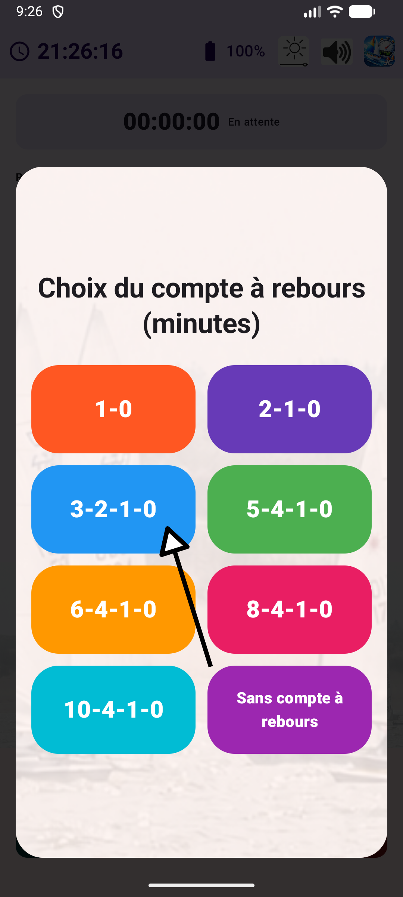
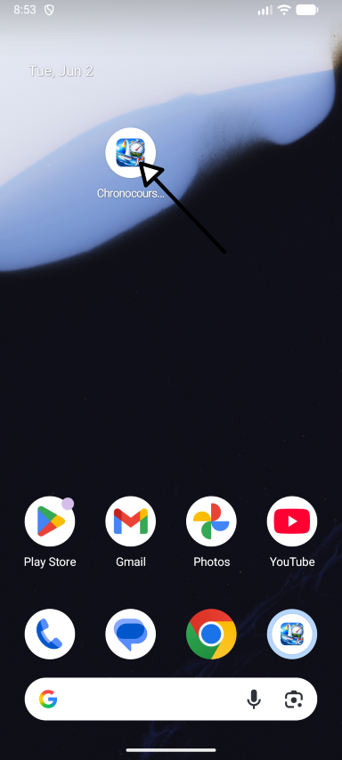

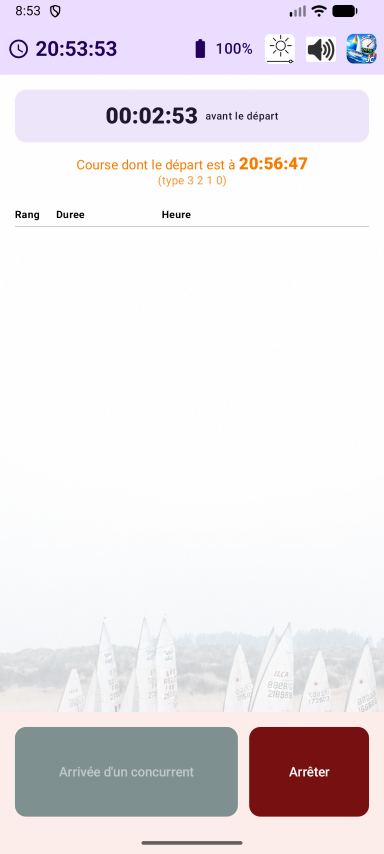
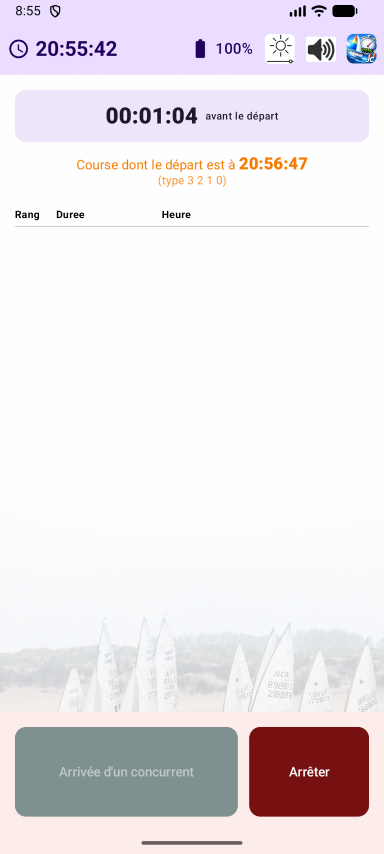

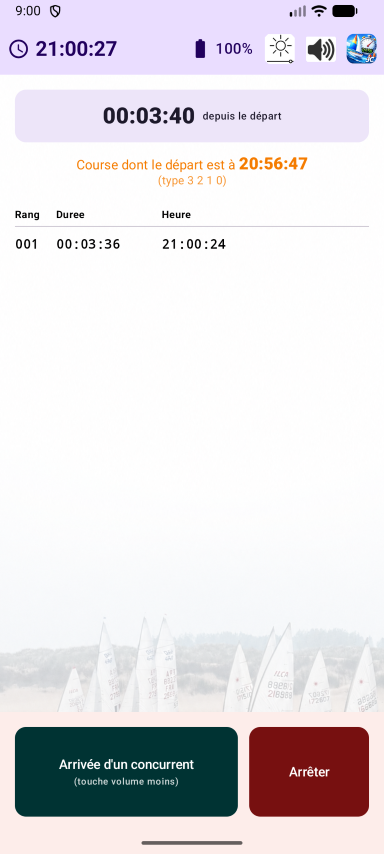
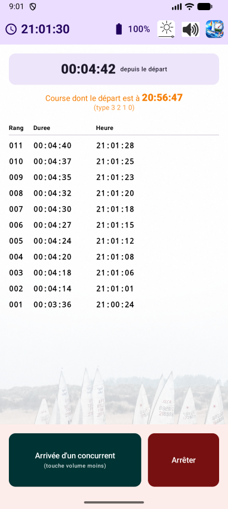
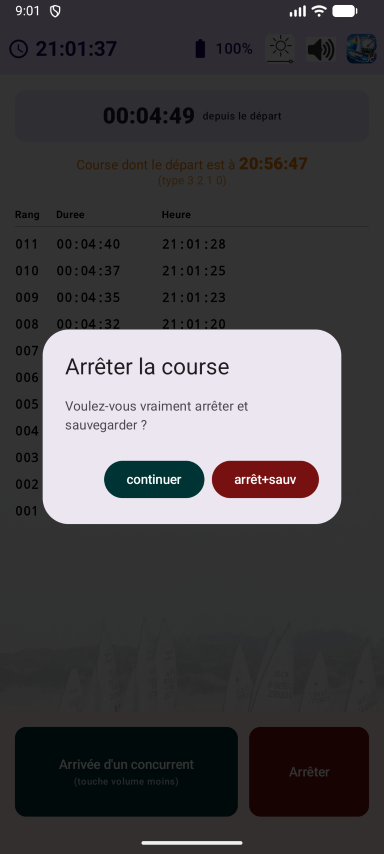
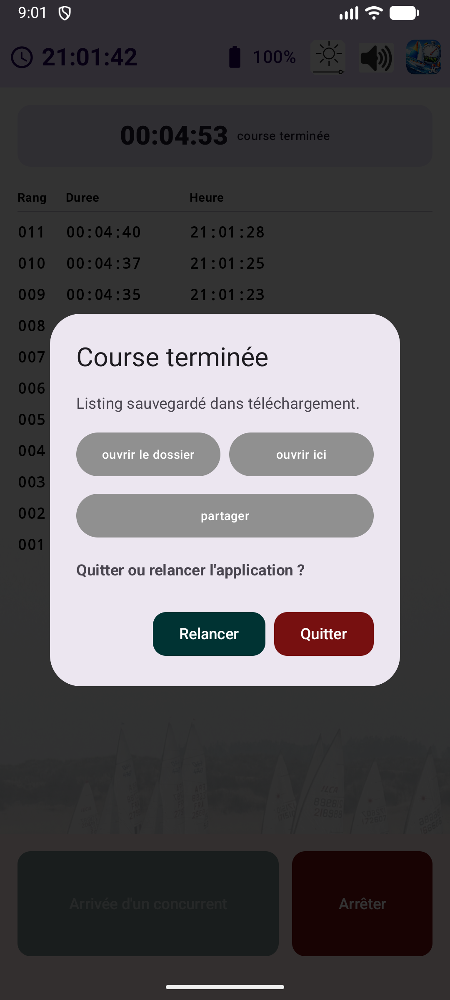
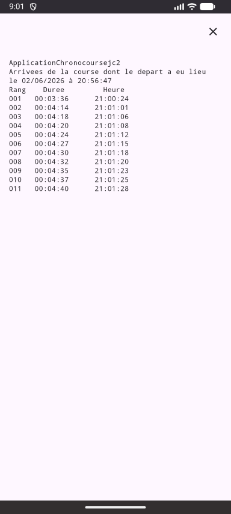
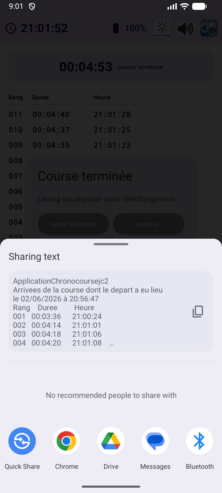
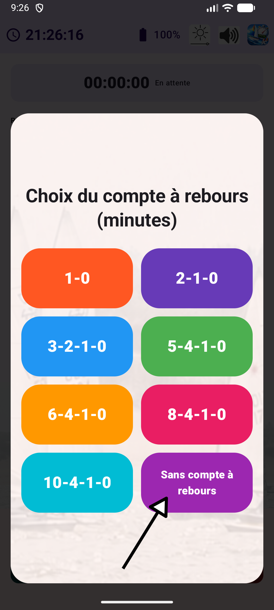
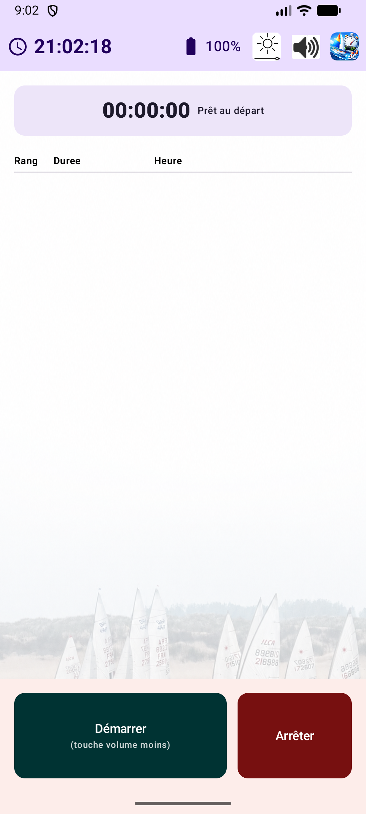

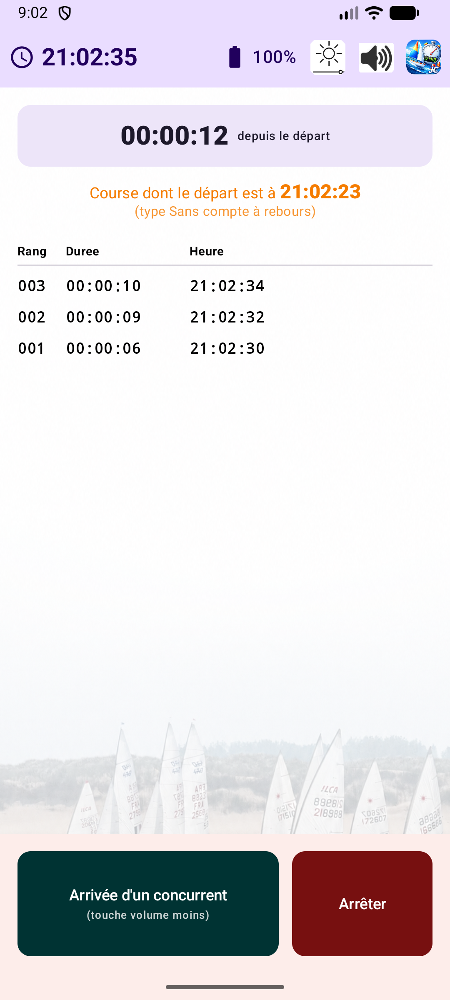
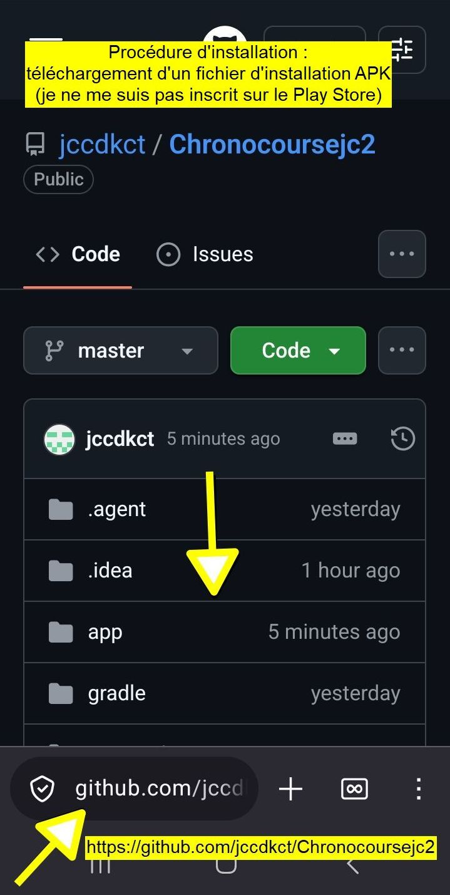
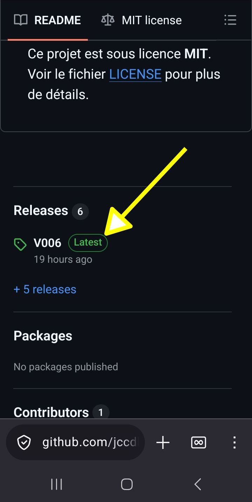
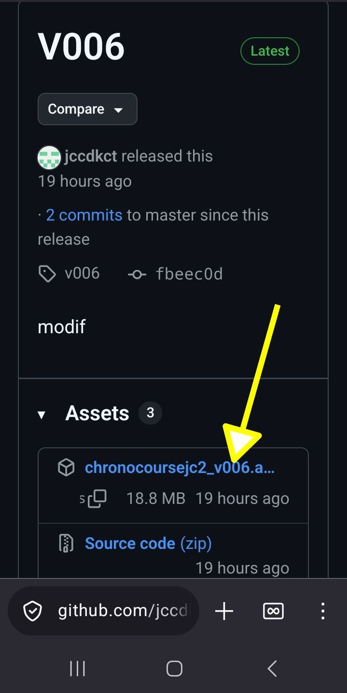
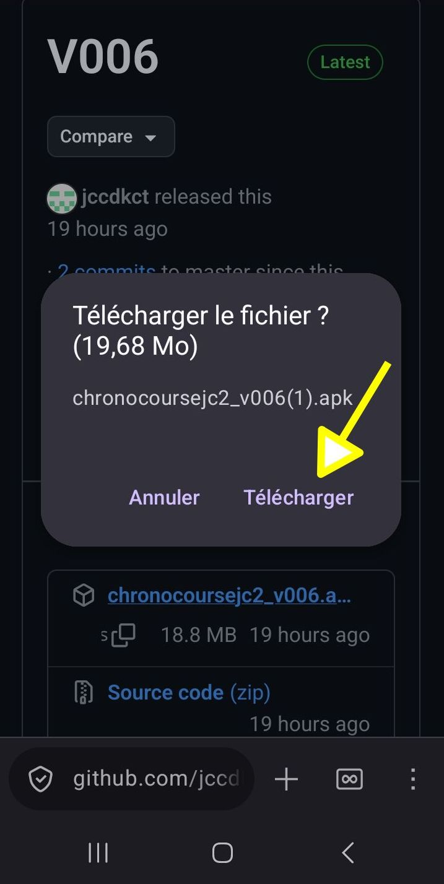
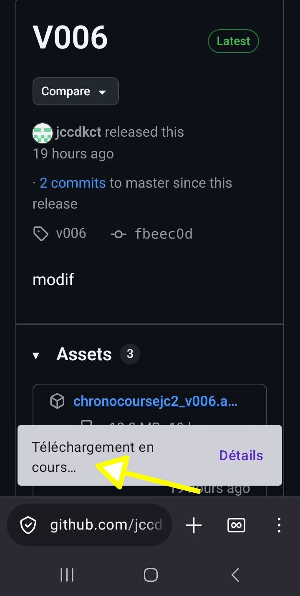
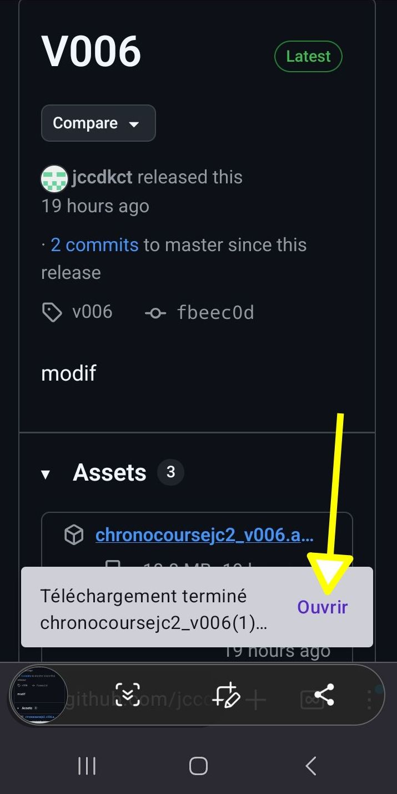

